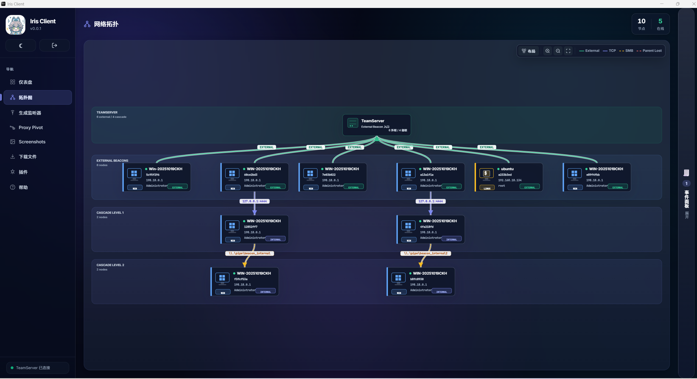

# Changelog

## v0.4.0

### Client

- 新增 — 内嵌 MCP Server，Agent 可直接驱动监听器、beacon、命令、文件和事件
- 新增 — 远程文件预览（文本 / 图片白名单，内存中转，不落盘）
- 新增 — 工作台 BottomDock：控制台、事件、传输收纳到窗口底部
- 新增 — Beacon 备注、分组、勾选批量删除
- 新增 — 文件浏览器支持执行、原生拖拽上传，以及本 beacon 传输面板
- 新增 — 登录记住密码（只有登录成功才写入）
- 变更 — 登录改为 CS 风格统一密码
- 变更 — Wails 3 从 alpha.47 升到 beta.15
- 变更 — Linux 快捷入口从「我的桌面」改为「我的 Home」
- 变更 — setattr 下发 Unix 权限位，界面仍显示 644 这种八进制
- 修复 — TeamServer 重启后，有效 JWT 第一次 `/connect` 就能恢复，不必干等到静默重登
- 修复 — 文件浏览器命令失败不再显示成空目录
- 修复 — 传输进度丢帧后不再把进度写错
- 修复 — Windows 执行带空格、括号的文件名
- 若干优化

### Server

- 新增 — 会话备注、分组、批量删除 API
- 新增 — `GET /transfers/active` 传输对账快照
- 新增 — 远程文件预览（Beacon 不用改）
- 变更 — 登录改为 CS 风格统一密码，带用户名占用和断连宽限
- 修复 — 进程重启后，有效 JWT 第一次认证即可重建内存会话
- 修复 — 下载完成不再拿 FileID 当内容哈希比对（go-beacon 的 FileID 是元数据哈希，会误报 mismatch）
- 修复 — 结构化结果不再整包走 ACP 文本启发式，目录浏览不会再全量失败
- 修复 — beacon 文本按 ACP 转 UTF-8，shell 中文不再乱码
- 修复 — 大文件上传按字节预算出队，避免云函数中转截断后卡在 0/N
- 修复 — 目录 mtime 升到毫秒
- 若干优化

### C-Beacon

- 新增 — syscall 间接调用：recycled / halos gate，invoke 随机化
- 新增 — PPID 伪装，目标进程名或 PID 写在 profile 里，TSCF 可开关 syscall
- 优化 — 隧道
- 修复 — shell / powershell 接入 PPID 伪装：stdio 改用管道并复制进假父进程，不再依赖控制台句柄
- 修复 — 级联 HELLO 读帧 30 秒超时；WOULDBLOCK 按进度窗口重试，不再死等
- 修复 — 文件浏览 FILETIME 转成 Unix 毫秒，跟前端日期对得上
- 若干优化

### Go-Beacon

- 新增 — 隧道与 C-Beacon 对齐，支持批量回传
- 变更 — Windows 构建改为无窗口，运行时不再打控制台
- 修复 — setattr 同时认 Unix 权限位和旧的十进制「644」
- 修复 — Windows shell 走 `CmdLine` 原样下发，括号路径不会被二次加引号
- 修复 — 文件浏览 ModTime 改为 Unix 毫秒
- 若干优化

## v0.3.0

### Client

- 新增 — `vue-i18n` 基础设施与语言切换器，支持中文 / 英文切换（当前仅支持这两种语言）
- 新增 — 基于 CDP（Chrome DevTools Protocol）的 e2e 冒烟脚本，可驱动 Wails3 WebView 进行页面加载断言与运行时状态检查，方便 AI 直接调试与修复 bug
- 新增 — Sketch 手绘主题（第 4 套）
- 变更 — 前端从 JavaScript 全量迁移到 TypeScript
- 变更 — 插件 schema 升级到 v2，减少 `plugin.json` 的声明量
- 修复 — Tunnel 创建对话框布局问题

### Server

- 新增 — 钉钉机器人 Beacon 上线通知
- 新增 — 可观测性三件套：`healthz` 健康检查、运行指标采集、操作审计
- 变更 — 命令结果分发注册表化
- 修复 — 关闭任务下发一致性窗口，加固运行态竞态
- 修复 — 忽略已删除 Beacon 的迟到传输分块与 ACK
- 重构 — Listener 锁粒度细化、WS 写协程与 TTL 清理
- 重构 — 心跳写库合并、tunnel 数据面免持久化、SQLite 基线加固

### C-Beacon

- 测试 — 新增 `BEACON_TEST` 测试框架，注入随机源与 Winsock 钩子，覆盖加解密、任务、启动、发件箱等场景，配套测试工程与构建脚本
- 修复 — 随机数接口改为可报错，初始化失败即清理
- 修复 — 任务关闭时不再无限等待 Worker 退出
- 修复 — BOF 释放顺序
- 修复 — exit 前同步关闭级联通道
- 变更 — Release 改用 ClangCL 编译，产物统一加 external/internal 命名，同步批处理脚本与 README
- 变更 — 默认 C2 地址与加密密钥更换

## v0.2.0

### Client

#### 前端

- 加了事件总线 `shared/bus.js`，把 agent↔explorer、console→agent、wsEventRouter 和一堆 store 之间的循环依赖拆开了，初始化时那些时序 hack 可以扔掉了
- 协议字段别名收口到 `shared/protocol/fieldMap.js` 和 `adapter.js`，别处不再东拼西凑 `a.x || a.y`
- 几个大组件砍了一刀：FileBrowserModal 1599→1217、ProxyPivotPage 1490→1046、ListenerDialog 1374→1302、ConsolePanel 1054→958
- Paper 主题继续走冷白，加了点纸质纹理
- Tunnel 流量统计改成每 3 秒轮询一次，避免面板假死

#### 后端

- `service` 单包拆成 `service/internal/` 子包（args / tls / transport / plugin / file），用包可见性把分层钉死
- HTTP client 共用，context 一路往下传；proxy 出错会带回 HTTP 状态码，不再把 4xx/5xx 吞掉
- WebSocket 在锁外关闭，修掉死锁；TLS 跳过校验改由环境变量 `IRIS_TLS_SKIP_VERIFY` 控制
- file_service 手搓 JSON 换成 `json.Marshal`，类型 switch 归一，hydrate 去重

#### 测试与 CI

- 上了 vitest + @vue/test-utils + jsdom，单测从 0 到 332，盖住 11 个工具/composable 模块
- 原来的 6 个 `check:all` node:assert 契约测试还留着
- GitHub Actions：push 到 dev 跑测试；打 `v*` tag 时三端 build 并发 Release
- v0.2.0 已出三端包：Windows zip / macOS zip（arm64 未签名）/ Linux AppImage + deb + rpm

### Server

#### 新功能

- **C2 Profile 驱动的 HTTP Transforms**：listener 能按 c2profile 配 GET/POST 变换（metadata 位置、name、prefix、encoding、output mode 等），Beacon 通信行为可以模板化。HTTP/HTTPS 协议目前也支持走云函数
- **Tunnel 流量周期广播**：每 2 秒给所有 running 的 tunnel 推一帧完整 TunnelView（含流量和活跃 channel 数），前端「流入/流出」能实时动起来；没在跑的不推
- **http_post stage output 改 base64/print**：POST 回传用 base64 塞进可打印字段，受限链路里也好带数据
- **Beacon 模板命名统一**：C-Beacon / Go-Beacon 模板统一成 `beacon_{proto}_{external|internal}_{os}_{arch}.{ext}`，并把 C-Beacon 的 HTTP/TCP external、TCP/SMB internal DLL 模板补齐
- **Go-Beacon payload 生成**：`/api/v1/payload/generate` 增加 `beacon_type`（`c` / `go`）；补上 Go-Beacon external HTTP（windows / linux / mac）和 internal TCP/SMB（windows amd64）模板；`go + external tcp` 组合服务端直接拒绝

#### Bug 修复

- 文件落盘名 sanitize 修正，中文等 Unicode 文件名能保住
- tunnel 和 cascade-read 类任务块不再去查库，少做无用功
- tunnel 停掉时，在途连接的 pipe-closed WARN 噪音压掉了
- Linux CI 暴露的跨平台问题：basename 分隔符按平台走、SOCKS5 E2E 别再死磕 DNS
- tunnel channel 字节计数的 data race（`-race` 抓到的）修好了
- release workflow 的打包路径和 CGO/sqlite 问题理顺，产物能正常跑起来

#### 重构

- Server 启停改成 context 感知，超时后按序关掉各子系统、清内存态，临时文件不乱留
- 拆出 transfer / stage / cascade / payloadprofile 等子包，状态收进各自 Service，子域不再反向依赖 server 根包
- 命名和规范收一收：包名小写下划线、错误用 `%w` 包、gofmt
- tunnel 里的死代码清掉了

#### 测试

- beacon manager、cascade service、task 等补了 1400+ 行单测：模块注册、任务队列、pack-process 往返、命令派发、TaskID 计数、gateway 路由都盖到了

#### 工程化

- Makefile 补上 build / test / vet / clean，工作区里堆的构建产物清一清
- GitHub Actions：push main/dev 跑 vet + test + build；打 tag 矩阵编多平台产物并发布
- 二进制版本号走 ldflags 注入
- 基础 TLS 证书进版本库并打进 Release，避免用户下完包 HTTPS 起不来

### C-Beacon

- **任务包 / 结果包 HTTP 编解码**换成 **HTTP Transform wire**，不再是「心跳头 + body payload」那一套
  - 按 profile 配 metadata（加密心跳）、stage_output（加密结果）、server_output（加密任务）的位置和编码
  - body / header / query，raw / base64 / base64url 都能上，prefix/suffix 可选
  - 主循环和回传统一走 `TransportHttpTransformExchange`；空响应和 404 当无任务
  - 旧的 `hb_header` / `hb_prefix` 固定心跳头去掉了，改解析 `CfgHTTPTransform` TLV
- TCP 级联 connect 对齐：允许只写 `host:port`，没 child_id 时退回地址形式；Debug TCP 心跳改用 external encrypt_key
- Exit 时先 `CascadeShutdownAll` 同步关掉所有子通道并入队 Dead，再设 `should_exit`，本周期 flush 就能把 Dead 送到 TeamServer
- 编码风格和类型约定统一了一遍
- BOF、HTTP/TCP 传输、PostEx、Migrate 等关键路径补了函数级注释
- 硬编码魔数清掉一些，加密相关注释改对（实际是 AES-256-GCM），已知限制和优化说明文档补上了
- 重复工具逻辑合并：大端读写、带超时 TCP 连接、Outbox 统一回传骨架、PostEx/Migrate 共用注入辅助
- 内部头文件统一归到 `include/`
- 级联 I/O 加了 TCP/PIPE 后端操作表，Close / 读帧 / 写帧走查表分发
- Tunnel 多连接同步拨号会堵主循环、心跳也会断；拨号和读循环改成工作线程异步干
- tunnel 拆成 server / client / frame；Outbox 批量加密后一次发出去

### Go-Beacon

#### Profile / HTTP 传输对齐 C Beacon

- Profile 解析补上 `CFG_SLEEP_IMAGE_LAYOUT` 和 `CFG_HTTP_TRANSFORM`
- HTTP 侧按 C 风格 transform 结构体走，带默认 GET/POST 基线
- HTTP 客户端切到 transform 请求/响应路径，旧路径先留着当 fallback
- `tools/patch_profile` 按 C 基线 wire 输出 `CFG_HTTP_TRANSFORM` 块
- `profile.example.json` 默认值跟 C beacon 基线对齐
- 补了 profile / http / tools 测试，`go test ./...` 过了

#### Cascade 与 Result Exchange

- 加了 `Transport.Exchange`，HTTP 流量收口到 transport 接口
- result exchange 回来的服务端任务会正常派发
- transfer、tunnel 运行态挪到 `Handler` 自己的实例里
- TCP cascade 支持 80–87 命令，host/port 连接也能用
- cascade 的 open / read / dead / ping 当末包入队，靠 outbox 刷出去
- 空响应、带 404 Page Not Found 的 transform 响应都当无任务
- cascade、result exchange、transfer、tunnel 实例状态都补了测

#### 内部 Cascade（TCP / SMB）

- TCP 和 SMB 共用 cascade frame/link helpers；Windows 命名管道走 go-winio
- 内部 TCP/SMB child runtime：HELLO、收任务循环、结果经 cascade 帧往上转
- Profile 补丁/解析扩展，能带内部 listener 配置
- cascade 命令处理和空-child SMB link 场景的测试对齐了
- Exit 时先 `CascadeShutdownAll` 同步关掉所有子通道并入队 Dead，再设 `should_exit`，本周期 flush 就能把 Dead 送到 TeamServer

## v0.1.5

### Client

- 新增 — `spawnto`、`migrate_spawn`、`migrate_inject` 控制台命令支持，包括参数解析、帮助信息、基础校验和事件面板标记
- 新增 — 进程浏览器中的 `Migrate Inject` 图形化操作流，支持基于目标进程自动复用架构，并阻止危险的 `x86 parent -> x64 target` 组合
- 新增 — 图形化迁移流程支持筛选 external 与 internal `TCP/SMB` listener，并补充相应的拓扑行为提示
- 变更 — 统一命令结果、文件传输、事件面板摘要到 TeamServer 的 `COMMAND_EVENT` 协议模型
- 变更 — 对齐前端命令参数打包格式，收口命令结果路由与结构化结果处理逻辑
- 修复 — `ps`、`net_info`、`netstat` 等命令结果在新旧 TeamServer payload 结构下的兼容显示
- 修复 — 文件浏览器中同一下载任务出现多个 `0%` 进度记录的问题，改为按 `direction + task_id` 合并传输进度
- 修复 — 统一 websocket 事件别名与历史兼容逻辑，补齐 `tunnel`、`listener` 相关事件同步
- 修复 — 截图预览删除按钮对比度问题
- 维护 — 更新 Iris Client 版本显示与各平台打包元数据到 `v0.1.5`

### Server

- 新增 — TeamServer 对 `spawnto`、`migrate_spawn`、`migrate_inject` 的完整任务处理能力
- 新增 — external listener 的 direct-stage 迁移流程
- 新增 — internal TCP 迁移支持，为每个任务分配独立的 bind 端口并建立 cascade child 跟踪
- 新增 — internal SMB `migrate_inject` 支持，为注入后的 child 生成独立的 pipe 名并自动排队后续 `cascade connect/link`
- 变更 — 将 migrate inject 子命令语义收口为 stage-oriented 命名，同时保持既有 wire value 不变
- 测试 — 增加 internal `TCP/SMB` migrate inject 行为测试与相关任务校验
- 变更 — 统一 websocket 事件常量，移除旧的 `TASK_RESULT`、`FILE_TRANSFER_*` 独立事件路径
- 变更 — 将 listener 状态变更与 tunnel 确认事件改为统一的具名事件常量，减少历史分支逻辑

### C-Beacon

- 新增 — migrate manager，支持 `spawnto`、`spawn`、`inject` 三类迁移路径
- 新增 — 基于 reflective stage 的远程执行能力，打通 Beacon 侧迁移命令与 TeamServer stage 下发链路
- 新增 — 目标进程架构校验、父子架构匹配校验以及远程线程/远程进程状态诊断输出
- 新增 — internal TCP migrate stage 构建脚本与模板同步支持
- 新增 — internal SMB direct-stage DLL 构建流程，并将 SMB internal DLL 纳入模板 patch/copy 同步链路
- 变更 — 将 migrate inject 子命令重命名为 stage-oriented 语义，但保持原有协议值兼容
- 重构 — 整理命令分发与 inject 辅助逻辑，减少迁移路径中的重复实现
- 文档 — 更新 README 与模板产物说明，补充 internal SMB 相关构建与同步文档

## v0.1.4

### Client

- 新增 — PostEx 插件动作工作流，支持 `spawn-dll` / `inject-dll`、按架构选择 DLL、按架构默认值和加载期 manifest lint
- 新增 — PostEx 结构化事件展示，支持 metadata、progress、artifact、error frame
- 新增 — PostEx artifact 下载接入 Downloads 页面，使用 Server 解析后的 artifact 字段和下载标识
- 修复 — Downloads 页面滚动、表头和自动刷新体验

### Server

- 新增 — PostEx server 侧命令与事件处理，支持 `spawn_dll` / `inject_dll` 子命令、异步 frame 事件和 artifact 下载
- 新增 — C2 Profile 支持 Gargle sleep obfuscation 配置
- 修复 — PostEx artifact 下载标识与 Client 对齐
- 修复 — Listener TLS 增加 Windows 7 cipher fallback，HTTP、stager、TCP listener 共用兼容配置
- 维护 — 刷新 internal C-Beacon 模板和 payload/cascade 模板

### Beacon

- 新增 — Gargle sleep obfuscation 支持，这是为了绕过CFG保护，提前为“迁移”功能模块做准备。
- 新增 — PostEx 模块执行框架，支持 backend 拆分、job 轮询、结构化 frame 输出和 artifact/error helper
- 加固 — PostEx job 边界、轮询流程和 reflective loading 架构校验
- 修复 — 禁用 CFG 敏感的 reflective stomping 路径
- 修复 — Win7 WinHTTP 强制 TLS 1.2

## v0.1.3

### Beacon

- 变更 — 睡眠混淆改用 patched PE 头部信息到 Beacon，并且 Beacon 通过入口 WinMain 或 DllMain 传递基址
- 新增 — TCP 外部 Beacon 传输及 TLS 构建支持
- 重构 — 核心模块拆分：agent 模块拆分、BOF 模块拆分、cascade 模块拆分、构建产物重命名

### Client

- 新增 External TCP 监听器支持，含 SSL/TLS 开关
- 仪表盘 Beacon Session 表格新增 C2 协议列
- 修复：现在支持生成 x86 架构的 Internal TCP/SMB Beacon

## v0.1.2

### Client

- 新增米黄 Paper 主题
- 新增 PageTitleIcon 组件，8 个页面统一使用 SVG 图标
- 修改应用图标
- 文件浏览器、进程浏览器、网络浏览器等对话框根据窗口大小动态调整位置，始终居中

## v0.1.1

### Bug Fix

- 修复 stager 模式发送 beacon_type 导致模板找不到的问题，现在可以正确生成 stager

## v0.1.0

### Client

- 新增 Dark UI 主题
- 新增拓扑界面，支持右键点击节点进行操作
- 新增 TCP / SMB Internal Beacon 的生成选项

### Beacon

- 新增级联传输 — TCP / SMB Internal Cascade Beacon，支持多级跳转
- 新增 Go-Beacon 跨平台 Beacon，支持 Windows、Linux、macOS 三端系统
- Go-Beacon 中 Linux、Windows 均支持 BOF loader 能力，可使用 Client 项目自带的插件进行实验

