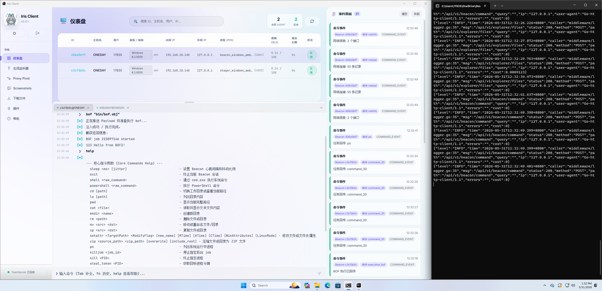
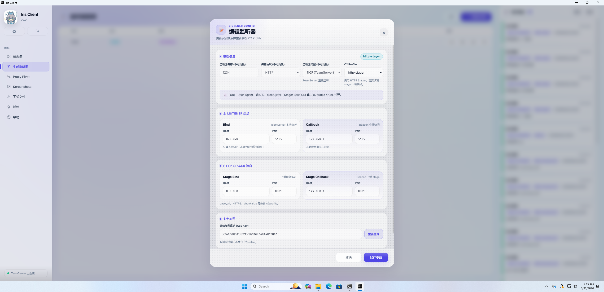
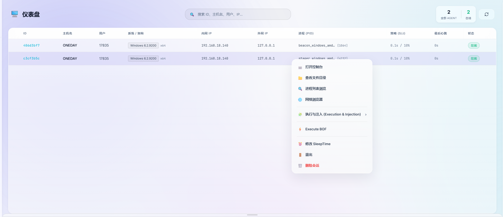
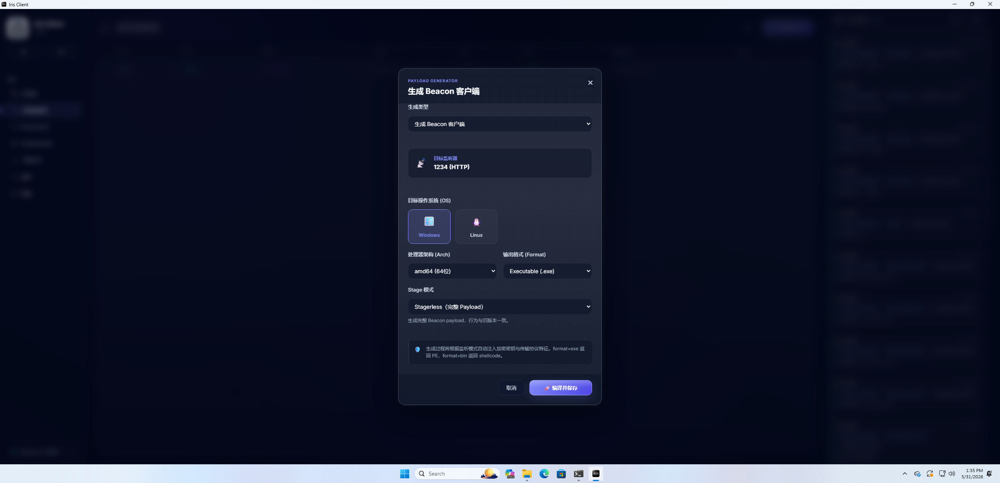

# IrisC2

语言：中文 | [English](README.en.md)

IrisC2 是一个面向授权安全测试、红队演练、攻防实验和内部研究的 C2 框架。项目由 Client、Server、Beacon、Stager 和插件体系组成，围绕 Listener 管理、Payload 生成、Beacon 任务调度、文件传输、截图、隧道转发、BOF 执行和实时事件同步构建。

> 本项目仅允许在明确授权的环境中使用。请勿在未授权系统、账号、网络或第三方资产上部署、连接、测试或运行任何组件。

## 项目组成

```text
IrisC2/
├── C-Beacon/           C 语言 Beacon 源码、构建脚本和 reflective stub patch 工具
├── Go-Beacon/          Go 语言跨平台 Beacon 源码（Windows / Linux / macOS）
├── client/             Client 源码（Wails 3：Go + Vue/TypeScript 前端）
├── stager_shellcode/   Windows x64/x86 stager 源码、构建脚本和 patch 工具
├── images/             README 演示图片与视频
├── CHANGELOG.md
├── README.md
└── README.en.md
```

Client 源码位于 `client/`，基于 Wails 3 构建（Go + Vue/TypeScript）。Server 通过 GitHub Releases 以发布包形式提供，源码不包含在仓库中。Beacon 与 stager 相关源码包含在本仓库中，可按各自目录下的 README 构建和更新模板。

## 工作方式

- Client 负责操作界面、任务下发、结果查看和插件入口。
- Server 负责认证、Listener、Payload、任务、文件、截图、隧道和事件同步。
- Beacon 在授权目标环境中运行，按 C2 Profile 与 Listener 通信并执行任务。
- Stager 用于 staged payload 场景，先下载 stage，再启动 Beacon stage。
- 插件通过 Client 暴露 BOF/OBJ 等扩展动作，统一下发到 Beacon 执行。

## 演示

GitHub 仓库页面可能不会直接预览较大的 LFS 视频。可以直接打开 [演示视频](images/video.mp4)，或在 Release 页面下载查看。

### 界面截图









## 功能特点

### Client

- 支持 Windows、Linux、macOS 发布包。
- 连接 Iris Server 后进行登录、会话保持和实时事件接收。
- 管理 Listener、Payload、Beacon、任务、文件、截图和隧道。
- 支持 Beacon 右键菜单和插件动作入口。
- 支持将插件目录中的 `plugin.json` 与工件文件自动组织为可执行动作。
- 支持常见任务参数表单，例如字符串、下拉选项和必填字段。

Client 源码位于 `client/`，基于 Wails 3 构建，后端使用 Go，前端使用 Vue + TypeScript。需要自行从源码构建，详见 [client/README.md](client/README.md)。

构建产物中会包含插件目录：

### Server

- 基于账号密码和 JWT 的 API 鉴权。
- 支持同名用户单会话登录，新登录会替换旧会话。
- 提供 REST API 与 WebSocket 事件通道。
- 支持 HTTP/HTTPS Listener；Server 侧包含 TCP Listener 相关能力，但当前公开 Beacon 的 C2 回连以 HTTP/HTTPS transport 为准。
- 支持 Listener 创建、编辑、暂停、恢复、删除和列表查询。
- 通过 C2 Profile 管理 Beacon sleep、jitter、HTTP URI、Header、User-Agent、stager 等行为。
- 支持 stagerless 与 staged payload 生成。
- 支持 Windows x64/x86 Beacon 模板和 stager 模板。
- 支持任务持久化、pending 任务恢复、任务状态跟踪和结果回传。
- 支持文件上传、Beacon 文件下载、分块传输、截图管理和隧道转发。
- 支持 SQLite 本地持久化、运行日志和基础伪装响应配置。

Server 成品通过 GitHub Releases 发布。每个平台包内都会包含运行所需的 `config.yaml`、`c2profile/` 和 `static/`：

```text
Iris-Server-v0.1.1-windows-x64.zip
Iris-Server-v0.1.1-linux-x64.tar.gz
```

### Beacon

Beacon 源码位于 `C-Beacon/`。当前 Beacon 侧能力包括：

- HTTP/HTTPS C2 通信。
- 首次上线注册、心跳刷新和会话密钥更新。
- sleep time、jitter 和 sleep obfuscation 配置。
- sleep obfuscation technique 支持：
  - `0` = none
  - `1` = ekko
  - `2` = zilean
- 基础控制：Sleep、Exit。
- 命令执行：Shell、PowerShell。
- 文件系统：Cd、Ls、Pwd、Cat、Mkdir、Rm、Mv、Cp、SetAttr、Zip。
- 文件传输：Download、Upload。
- 文件浏览：FileBrowser。
- 进程、作业和身份：Ps、Jobs、KillJob、Kill、StealToken、Whoami。
- 网络信息：Netinfo、Netstat。
- 截图：Screenshot。
- 隧道：SOCKS/端口转发类 tunnel start、control、data、close。
- 扩展执行：BOF/OBJ 加载、重定位、执行、输出回传和任务取消。
- 级联传输：支持 TCP 和 SMB（命名管道）两种 internal beacon，父 Beacon 可通过 `connect` 或 `link` 命令建立级联链路，支持多级跳转（如 HTTP → TCP → SMB）。断开后 internal beacon 自动回到监听状态。

Beacon 构建产物部署到 `server/static/beacon_templates/C-Beacon/`：

```text
beacon_windows_amd64.dll          # x64 reflective DLL（需 patch）
beacon_windows_amd64.exe          # x64 HTTP/HTTPS EXE
beacon_windows_x86.dll            # x86 reflective DLL（需 patch）
beacon_windows_x86.exe            # x86 HTTP/HTTPS EXE
beacon_tcp_internal_amd64.exe     # x64 TCP 级联 Beacon
beacon_tcp_internal_x86.exe       # x86 TCP 级联 Beacon
beacon_smb_internal_amd64.exe     # x64 SMB 级联 Beacon
beacon_smb_internal_x86.exe       # x86 SMB 级联 Beacon
```

### Go-Beacon

Go-Beacon 源码位于 `Go-Beacon/`，使用 Go 语言实现，支持 Windows、Linux、macOS 三平台。

- HTTP/HTTPS C2 通信。
- 支持 Windows x64、Linux x64、macOS ARM 三端构建。
- Windows 和 Linux 支持 BOF loader，可使用 Client 自带的插件执行 BOF。
  - Windows x64：COFF 格式，VirtualAlloc + NtCreateThreadEx，含 VEH 崩溃恢复。
  - Linux x64：ELF 格式，mmap + 直接调用，含 GOT/trampoline 外部符号解析。
- 配置通过 TSCF v2 TLV 格式写入，支持 `tools/patch_profile.go` 工具。

Go-Beacon 构建产物部署到 `server/static/beacon_templates/Go-Beacon/`：

```text
beacon_windows_amd64.exe
beacon_linux_amd64.elf
beacon_mac_arm.macho
```

### Stager

Stager 源码位于 `stager_shellcode/`，用于 staged payload 场景。

- 支持 Windows x64/x86。
- 支持 HTTP/HTTPS 下载 stage。
- 支持 HTTPS 忽略证书错误配置。
- 支持 `thread` / `process` 退出模式。
- 使用 `STG2` 配置块，由 Server 或 `tools/patch_stager_config` 写入回连参数。

Server 读取的 stager 模板命名为：

```text
server/static/stager_templates/
├── stager_windows_amd64.exe
├── stager_windows_amd64.bin
├── stager_windows_32.exe
└── stager_windows_32.bin
```

请保持 `stager_windows_*` 前缀一致。Server 的 32 位 stager 读取路径是 `stager_windows_32.exe` / `stager_windows_32.bin`。

## 快速开始

### 1. 获取项目或发布包

Server 发布包可从 [GitHub Releases](https://github.com/onedays12/Iris/releases) 下载。Client 需要从源码构建，克隆仓库后按 [client/README.md](client/README.md) 说明操作，需要安装 Go、Node.js 和 Wails 3 CLI。

仓库使用 Git LFS 管理演示视频等大文件，首次克隆前建议先安装并启用 Git LFS：

```bash
git lfs install
git clone <repo-url>
cd IrisC2
git lfs pull
```

如果使用 HTTPS 克隆私有仓库，需要当前账号或 token 拥有仓库访问权限。

### 2. 配置 Server

解压 Server 发布包后进入目录，例如：

```bash
cd Iris-Server-v0.1.1-<platform>
```

编辑 `config.yaml`，重点检查：

```yaml
TeamServer:
  host: "0.0.0.0"
  port: 8080
  users:
    - username: "admin"
      password: "123456"
  jwt_secret: "change-this-secret"
  allowed_origins: ["*"]
  cert: "static/server.crt"
  key: "static/server.key"
database:
  path: "teamserver.db"
```

首次部署建议立即修改默认账号密码和 `jwt_secret`。发布包中如包含测试证书，只建议用于本地验证；正式环境请替换为自己的 `server.crt` 和 `server.key`。

### 3. 启动 Server

必须在 `server/` 目录内启动，保证相对路径能正确读取 `config.yaml`、`c2profile/` 和 `static/`。

Windows：

```powershell
.\TeamServer.exe
```

Linux：

```bash
chmod +x ./TeamServer
./TeamServer
```

默认服务地址按 `config.yaml` 中的 `host` 和 `port` 决定，例如：

```text
https://127.0.0.1:8080
```

### 4. 启动 Client

从源码构建 Client 后，产物位于 `client/bin/` 目录。构建命令详见 [client/README.md](client/README.md)。

Windows：

```powershell
cd client\bin
.\client.exe
```

Linux：

```bash
cd client/bin
chmod +x ./client
./client
```

macOS：

```bash
cd client/bin
open client.app
```

在 Client 中填写 Server 地址、用户名和密码登录。默认账号以 `server/config.yaml` 为准。

### 5. 创建 Listener

登录后，在 Client 中创建 Listener：

- 当前公开 Beacon 选择 HTTP/HTTPS Listener。
- 设置绑定地址、端口和回连地址。
- 设置通信密钥。
- 选择 C2 Profile，例如 `http-default` 或 `http-stager`。
- 启动 Listener 后确认状态为运行中。

### 6. 生成 Payload

在 Client 的 Payload 页面选择：

- Listener。
- 目标平台：当前主要为 Windows。
- 架构：`amd64` 或 `x86`。
- 输出格式：EXE、DLL、shellcode 或 stager，具体以 Client 页面支持项为准。
- C2 Profile：stagerless 使用普通 profile，staged payload 使用启用 stager 的 profile。

模板来源：

- stagerless payload 使用 `server/static/beacon_templates/`。
- staged payload 使用 `server/static/stager_templates/`，Server 会生成 stage 并由 stager 下载。

### 7. 管理 Beacon

Beacon 上线后，可在 Client 中查看会话、心跳、系统信息、任务结果和文件传输状态。常用操作包括：

- 执行 Shell / PowerShell。
- 浏览和操作文件系统。
- 上传、下载文件。
- 查看进程和作业。
- 截图。
- 启动或关闭隧道。
- 执行插件提供的 BOF/OBJ 动作。

## 插件使用

插件会随 Client 发布包一起提供，插件编写、字段格式、参数类型和示例如下。

在 Client 发布包中，插件位于：

```text
client/plugins/
```

每个插件是一个独立目录，至少包含：

```text
plugin-name/
├── plugin.json
└── bin/ 或其他工件文件
```

Client 发布包中的内置插件示例：

```text
client/plugins/
└── execution-injection/
```

### 使用步骤

1. 将插件目录放入 `client/plugins/`。
2. 确认插件目录中存在 `plugin.json`。
3. 确认 `artifact` 指向的 BOF/OBJ 文件存在，路径相对于插件目录。
4. 重启 Client 或刷新插件列表。
5. 在 Beacon 右键菜单或插件入口中选择对应动作。
6. 按表单填写参数并提交任务。
7. 在任务结果或 Beacon 输出中查看执行结果。

### plugin.json 格式

```json
{
  "name": "example-plugin",
  "display_name": "Example Plugin",
  "version": "1.0.0",
  "description": "插件说明",
  "actions": [
    {
      "id": "whoami",
      "label": "Whoami",
      "description": "获取当前 Beacon 会话身份",
      "artifact": "bin/whoami.x64.o",
      "command_id": 70,
      "requires_input": false
    }
  ]
}
```

带参数的动作可以声明 `fields`：

```json
{
  "id": "example_with_input",
  "label": "Example With Input",
  "artifact": "bin/example.x64.o",
  "command_id": 70,
  "requires_input": true,
  "fields": [
    {
      "name": "target",
      "label": "目标",
      "type": "string",
      "placeholder": "127.0.0.1",
      "default": "",
      "required": true
    }
  ]
}
```

字段说明：

- `name`：参数名，提交时使用。
- `label`：Client 显示名称。
- `type`：字段类型，常用 `string`、`select`。
- `options`：`select` 字段的候选值。
- `artifact`：插件工件路径，相对于插件目录。
- `command_id`：Beacon 命令 ID；BOF/OBJ 插件通常使用 `70`。
- `requires_input`：是否需要弹出参数表单。

插件工件需要与 Beacon 架构匹配。x64 Beacon 使用 x64 BOF/OBJ，x86 Beacon 使用 x86 BOF/OBJ。

## C2 Profile

C2 Profile 位于 Server 发布包中：

```text
server/c2profile/
├── http-default.yaml
└── http-stager.yaml
```

常用字段：

```yaml
beacon:
  sleep_time: 3000
  jitter: 20
  sleep_obf_enabled: true
  sleep_obf_technique: 2

http:
  uri: /index.php
  method: GET
  hb_header: Cookie
  hb_prefix: SESSIONID=
  user_agent: "Mozilla/5.0 ..."

stager:
  enabled: false
  base_uri: /assets
  https: false
  ignore_cert: false
```

`sleep_obf_technique` 可选值：

- `0`：none
- `1`：ekko
- `2`：zilean

`http-stager.yaml` 启用 staged payload；`http-default.yaml` 默认用于常规 HTTP Beacon。

## 构建 Beacon 模板

进入 Beacon 源码目录：

```bat
cd C-Beacon
build_all.bat
```

`build_all.bat` 构建全部 8 个产物：

```text
C-Beacon/x64/Release/Beacon_amd64.dll
C-Beacon/x64/ReleaseExe/beacon_windows_amd64.exe
C-Beacon/x64/ReleaseExeTcpInternal/beacon_tcp_internal_amd64.exe
C-Beacon/x64/ReleaseExeSmbInternal/beacon_smb_internal_amd64.exe
C-Beacon/x86/Release/Beacon_x86.dll
C-Beacon/x86/ReleaseExe/beacon_windows_x86.exe
C-Beacon/x86/ReleaseExeTcpInternal/beacon_tcp_internal_x86.exe
C-Beacon/x86/ReleaseExeSmbInternal/beacon_smb_internal_x86.exe
```

DLL 需要经过 reflective stub patch 后再部署。可使用 `sync_teamserver_templates.bat` 一键完成构建、patch 和部署，或手动操作，详见 [C-Beacon/README.md](C-Beacon/README.md)。

部署目标位于 Server 发布包内：

```text
server/static/beacon_templates/C-Beacon/
```

## 构建 Go-Beacon 模板

进入 Go-Beacon 源码目录：

Windows：

```bat
cd Go-Beacon
build_windows.bat
```

Linux：

```bash
cd Go-Beacon
chmod +x build_linux.sh
./build_linux.sh
```

macOS (ARM)：

```bash
cd Go-Beacon
chmod +x build_mac.sh
./build_mac.sh
```

产物位于 `Go-Beacon/bin/`：

```text
Go-Beacon/bin/beacon_windows_amd64.exe
Go-Beacon/bin/beacon_linux_amd64.elf
Go-Beacon/bin/beacon_mac_arm.macho
```

部署目标位于 Server 发布包内：

```text
server/static/beacon_templates/Go-Beacon/
```

## 构建 Stager 模板

进入 stager 源码目录：

```bat
cd stager_shellcode
build_stager_x64.bat
build_stager_x86.bat
```

产物：

```text
stager_shellcode/x64/Release/stager_windows_amd64.exe
stager_shellcode/x64/Release/stager_windows_amd64.bin
stager_shellcode/x86/Release/stager_windows_32.exe
stager_shellcode/x86/Release/stager_windows_32.bin
```

部署目标位于 Server 发布包内：

```text
server/static/stager_templates/
```

详细 patch、测试和 HTTPS stage server 用法见 [stager_shellcode/README.md](stager_shellcode/README.md)。

## 责任声明

IrisC2 是授权安全测试与内部研究工具。使用者必须确保测试目标、账号、网络、payload、插件工件和采集数据均处于明确授权范围内。项目维护者不对任何未授权使用造成的后果负责。
